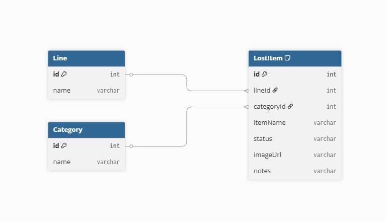

# AI電鉄 WEBサイト (ポートフォリオ)

Next.js と Tailwind CSS を使い、鉄道会社をイメージしてWEBサイトを制作致しました。 
企業サイトを想定し、ヘッダー、スライダー、お知らせ、企業案内なども作成しております。 

## AI電鉄について

当ポートフォリオで使用している車両や駅、沿線施設、忘れ物などの画像はGoogle DeepMind製画像生成AIツール**Whisk**で生成しております。 
AIが作った世界観という意味をこめて、「AI電鉄」という名前に致しました。

---

## デモサイト

要書換え
[https://ai-railway.vercel.app/](https://ai-railway.vercel.app/)

---

## 使用技術

- React

- Next.js 14（App Router）

- Tailwind CSS

- Swiper

- Prisma

- dbdiagram.io（ER図）

- Vercel（デプロイ）

- GitHub

---

## 主な機能

- トップページ

- 運転状況ランダム表示（リロード毎）

- 忘れ物検索機能（路線、種類）

- モーダル表示

- 安全・安心への取り組みページ

- 会社案内ページ

- レスポンシブ対応

---

## ER図

当サイトのデータ構造は以下のER図の通りです。

---

## 苦労点・気付き・学び

### こまめなコミットの大切さ

開発中に試行錯誤していて、どこを書き直したのか分からなくなり焦ることがありました。
ですが、直近のコミットがあったおかげで復旧でき、こまめにコミットする重要性を身をもって学びました。 また、コミットする際もConventional Commitsに従い、メンテナンスを考えてメッセージを意図や内容が分かるように丁寧に記述するよう心掛けました。

### コンポーネント化

このアプリは Next.js を使って作った初めてのプロジェクトです。 
コンポーネント化の仕組みを活用することで、画面構成を効率的に整理でき、再利用しやすい設計を体験できました。 
さらに、サーバーコンポーネントに use client は書けない など、エラーごとに仕様や制約を学ぶ機会も多く、開発を経て Next.js の理解を深めることができました。